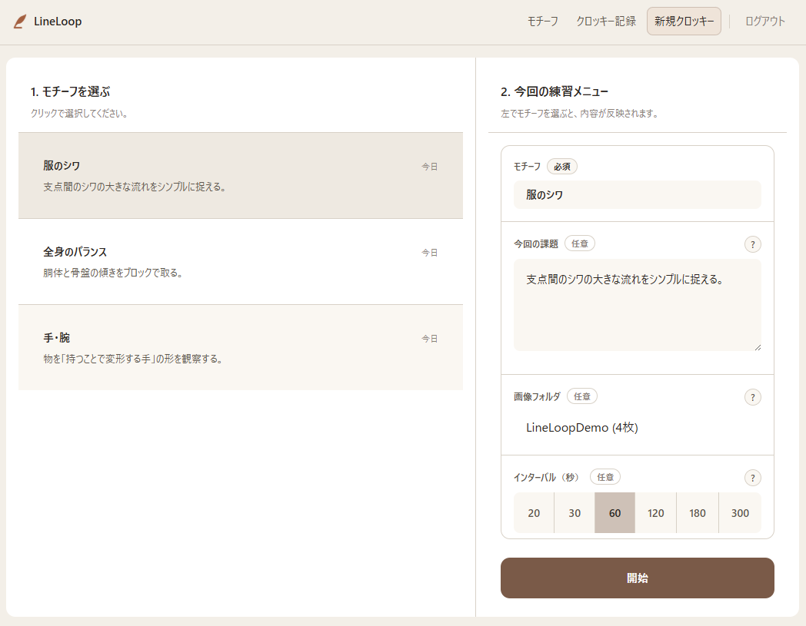
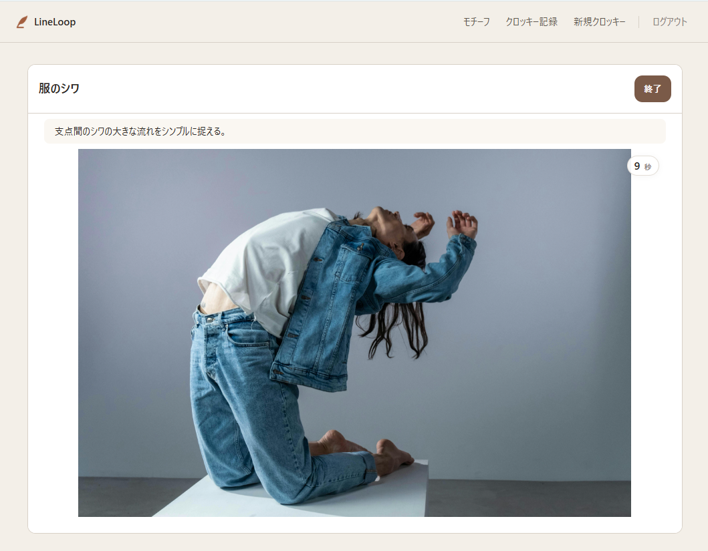
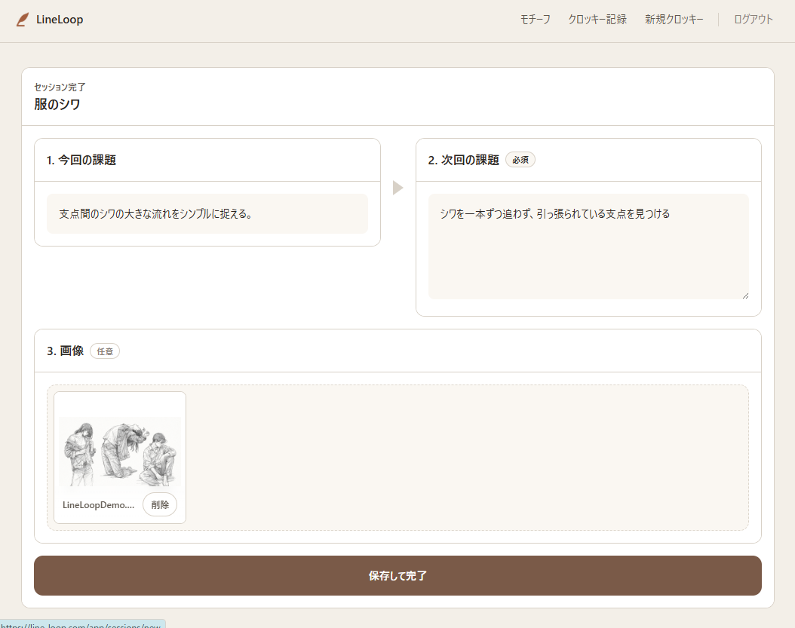
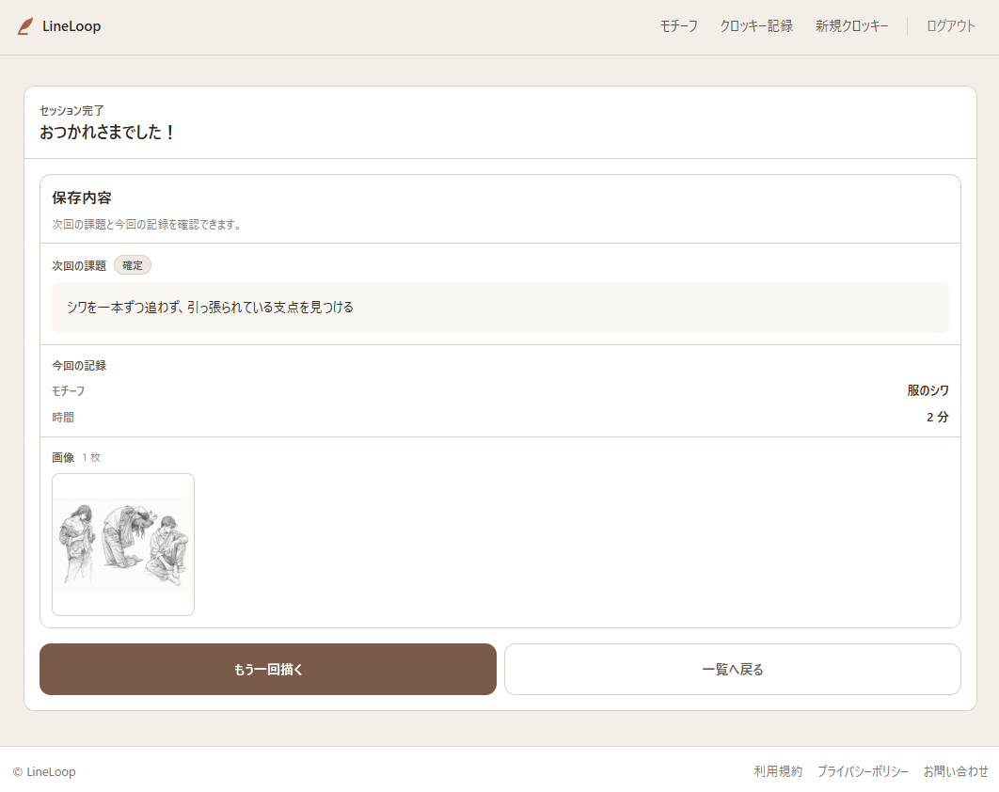

# LineLoop

LineLoop は、クロッキー練習を「描いて終わり」にしないための記録・管理アプリです。  
モチーフごとに課題を持って練習し、セッションごとに記録し、振り返りを通じて次回の練習につなげる流れを支援します。

---

## Demo

- Frontend: `https://line-loop.com`
- Backend API: `https://api.line-loop.com`

> デモ環境は低コスト構成で運用しているため、一定時間アクセスがない場合はバックエンドの初回応答に数秒かかることがあります。

---

## 背景

クロッキーは継続的な練習が重要ですが、実際には「その場で描いて終わる」形になりやすく、次のような問題が起きがちです。

- 何を意識して描いていたのかが後で分からなくなる
- モチーフごとの課題が蓄積されず、毎回ゼロから考え直すことになる
- 練習内容と振り返りが分断され、改善が継続しにくい

LineLoop は、こうした課題に対して、**練習そのものの提供ではなく、練習内容の蓄積と管理** に焦点を当てて設計したアプリです。

---

## コンセプト

一般的なクロッキーアプリは、参考画像を表示して描く体験の提供に重心が置かれがちです。  
LineLoop はそこから視点をずらし、**「何を描いたか」ではなく「どう練習を積み上げるか」** を扱います。

このアプリでは、次のような流れで練習を管理できます。

1. モチーフ（練習対象）を登録する
2. モチーフごとに課題を設定する
3. セッションを開始して練習する
4. セッション終了時に記録を残す
5. 振り返りをもとに課題を更新する
6. 次回の練習に接続する

---

## 設計上の特徴

### 1. モチーフ単位で課題を持てる
練習対象ごとに課題を管理できるため、単発の記録ではなく、継続的な改善の流れを作れます。

### 2. セッション記録と次回課題が分断されない
練習後の記録を残すだけで終わらず、その内容を次回の課題更新につなげられる構造にしています。

### 3. 参考画像をアプリで囲い込まない
参考画像はアプリが配布するのではなく、**ユーザーが選択したローカルフォルダ内の画像** を使う設計です。  
これにより、素材の自由度を保ちながら、練習管理の体験だけをアプリ側で支援できます。

### 4. 記録アプリとしての一貫性を重視
「画像を見る」「描く」「記録する」「振り返る」を一つの流れとして扱い、練習管理の分断を減らしています。

---

## 主な機能

### 認証
- サインアップ
- ログイン / ログアウト
- メール認証
- パスワードリセット

### セッション管理
- セッションの作成
- 練習中セッションの進行
- セッション終了時の記録保存
- セッション履歴の表示

### モチーフ管理
- モチーフの登録
- モチーフグループの管理
- モチーフごとの課題管理

### 参考画像運用
- ローカルフォルダ内の画像を参照して練習
- 一定間隔で画像を切り替えるスライド表示

### 練習結果画像管理
- Drawing画像のアップロード
- セッション履歴画面での表示

---

## Screenshots

### 1. セッション開始画面
モチーフを選択し、今回の課題・画像フォルダ・表示インターバルを確認してセッションを開始します。

> 参考画像用のフォルダ指定は任意です。  
> アプリ内のスライド表示を使わず、外部の資料や他のアプリを参照しながら練習した場合でも、LineLoop を記録と振り返りのために利用できます。



### 2. セッション中画面
選択したモチーフと課題を確認しながら、一定間隔で切り替わる参考画像を見て練習できます。



### 3. 振り返り画面
今回の課題を確認しつつ、次回の課題を更新し、練習結果画像を記録として追加できます。



### 4. セッション完了画面
保存された次回課題と今回の記録を確認し、次のセッションや一覧画面へ遷移できます。



---

## Tech Stack

### Frontend
- React
- Vite
- TypeScript
- React Router
- CSS Modules

### Backend
- Django
- Django REST Framework
- dj-rest-auth
- django-allauth

### Database
- PostgreSQL

### Infrastructure / Hosting
- Vercel
- Render Web Service
- Render Postgres
- Amazon S3

---

## Architecture

```text
Browser
  ↓
Vercel (Frontend)
  ↓
Render Web Service (Django API)
  ↓
Render Postgres

Media files
  ↓
Amazon S3
```

---

## デプロイ構成

初期の公開構成では、AWS 上で以下の構成を構築・運用していました。

- Route 53
- CloudFront
- S3
- Application Load Balancer
- ECS Fargate
- RDS PostgreSQL

その後、コストと運用負荷を考慮し、現在は以下の軽量構成にしています。

- Frontend: Vercel
- Backend: Render Web Service
- Database: Render Postgres
- Media Storage: Amazon S3

### Domain
- Frontend: `https://line-loop.com`
- Backend: `https://api.line-loop.com`

---

## 実装上のポイント

- フロントエンドとバックエンドを分離した構成
- Django REST Framework によるAPI提供
- `dj-rest-auth` / `django-allauth` を使った認証・メール認証フロー
- PostgreSQL を用いたデータ管理
- Drawing画像の保存先として Amazon S3 を使用
- 本番運用では Vercel / Render を用いてコストを抑制

---

## 開発時セットアップ

ローカル開発では Docker Compose を利用して、Frontend / Backend / PostgreSQL をまとめて起動できます。

### Docker Compose

```bash
docker compose up --build
```

起動後のアクセス先:

- Frontend: `http://localhost:5173`
- Backend: `http://localhost:8000`

停止する場合:

```bash
docker compose down
```

### 個別起動

#### Frontend

```bash
cd frontend
npm install
npm run dev
```

#### Backend

```bash
cd backend
pip install -r requirements.txt
python manage.py migrate
python manage.py runserver
```

#### Database

PostgreSQL を使用します。  
ローカル開発では Docker Compose 経由で起動する想定です。

---

## 今後の改善予定

### 短期的な改善
- 練習記録の閲覧性向上
- セッション中のタイマー機能の拡充
- モチーフ管理UIの改善
- セッション分析 / 振り返り導線の強化
- デプロイ / 運用構成の改善

### 中長期的な拡張案
- 練習履歴を俯瞰できるカレンダー表示
- 練習継続を支援する通知 / リマインド機能
- 練習記録を共有しやすくする出力機能の追加
- 記録内容や課題更新を補助する分析支援機能

---